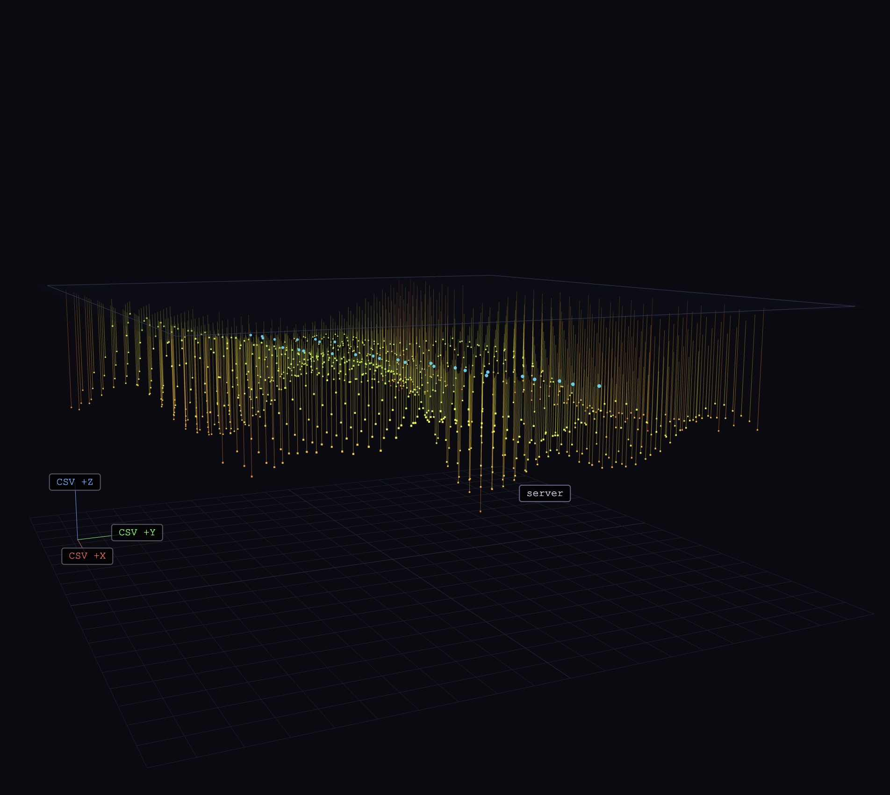
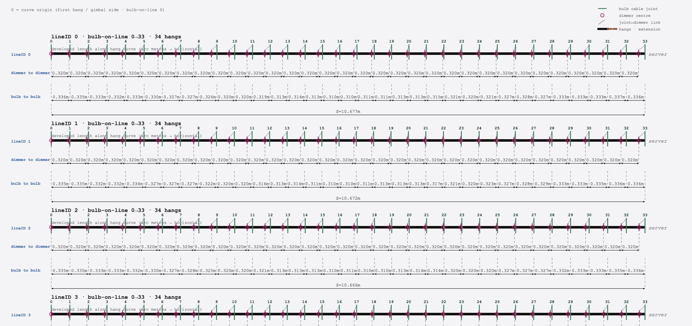

# Pulse Topology – Terminal cable viz

**Live demo:** [GitHub Pages](https://stephanschulz.github.io/topology-cable-viz-nyc/) · **Repo:** [github.com/stephanschulz/topology-cable-viz-nyc](https://github.com/stephanschulz/topology-cable-viz-nyc)

**Note:** Developed with AI assistance.

Interactive 3D view of cable hang points from `April23_001.csv` by default (or pass `?data=other.csv`). Each non-gizmo row is a mount at `(position_x, position_y, position_z)`; a vertical cable of length `Bulbcablelength(M)` (or any column matching `*cablelength*`) drops to the bulb. Rows with `AmI_*axis*indicator = True` are **orientation markers only** (designer: origin +X, +Y, +Z) and are drawn as an RGB 3-line cross, not as cable points.

## Screenshots

### 3D rig



### 2D cable unroll



**Scene mapping** (aligned with the Boston `topology-cable-viz` app): `X = mirror(position_x)` about the plan span, `Z = position_y`, and `Y = position_z − zMax` so the highest CSV `position_z` sits at scene **Y = 0** (ceiling plane) and longer drops extend to **more negative Y** — same convention as that app’s `y = −pz` with `pz` as depth below a ceiling at 0.

## Run locally

The app loads the CSV with `fetch()`, so you must serve the folder over HTTP (not `file://`).

```bash
cd "/path/to/topology-cable-viz"
python3 -m http.server 8000
```

Open [http://localhost:8000/](http://localhost:8000/) and use `index.html` at the root.

## Controls

- **Color by:** drop length, mount height (z), `lineID`, or `Universe`
- **Point size** / **Drop line opacity** — sliders
- **Mouse:** drag orbit, scroll zoom, right-drag pan, hover points for full CSV row + scene coordinates

## Stack

- [Three.js](https://threejs.org/) (ES modules from CDN)
- No build step; single `index.html`

## Data

- Runtime data: `April23_001.csv` (comma-separated; optional `?data=other.csv`).

Simplified from the earlier Boston `topology-cable-viz` static app (no wall-run routing).
